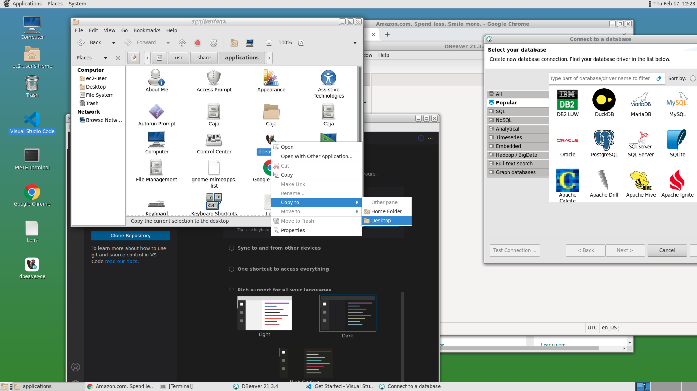

## Starting a Desktop Environment on AWS Cloud9 and access it securely using AWS Systems Manager port forwarding.



----

### 1. Create a Cloud9 environment

Use the AWS console to create a Cloud9 IDE

Use the options:
* `Create a new no-ingress EC2 instance for environment (access via Systems Manager)`

This ensures there is no inbound access to the Cloud9 instance

* Instance size `t3.small` (or larger)  
* Use `Amazon Linux 2` (required)

----

### 2. Install additional software on the Cloud9 IDE

**Clone this repo**

From a Cloud9 Terminal window:

```bash
cd ~/environment
git clone https://github.com/awsandy/cloud9-tunnel-desktop.git
```

**Install the desktop software and some sample apps**

```bash
cd cloud9-tunnel-desktop
./install-cloud9-desktop.sh
```

This script:

* Installs the AWS cli (v2)
* Increases the root disk size to 32GB
* Installs the Amazon Linux 2 minimal Desktop software
* Installs some sample apps:
  
  * The Chrome web browser 
  * DBeaver - an open source database management tools
  * Microsoft's Visual Studio Code IDE
  * LENS a tool for managing Kubernetes clusters
  
You may see some yum lock errors during the install of the sample apps, these should resolve themselves after seeing the error 3 or 4 times.

A password is created for the `ec2-user` user and is output on the console at the end of the script output along with the Cloud9 EC2 instance id.

The ec2-user password is also stored in the hidden file: `/home/ec2-user/.ec2user-creds`. This password will be needed in step 4.

----

### 3. Check your permissions 

Ensure you have these permissions for your IAM user or IAM role you use to sign in to AWS on your **local machine**:

```json
{
    "Version": "2012-10-17",
    "Statement": [
        {
            "Action": [
                "ssm:StartSession",
                "ssm:TerminateSession",
                "ssm:ResumeSession",
                "ssm:DescribeSessions",
                "ssm:GetConnectionStatus"
            ],
            "Effect": "Allow",
            "Resource": [
                "*"
            ]
        }
    ]
}
```

*Best Practice: reduce the scope of these permissions using a more specific resource and/or adding a condition clause.*

Note: Modified IAM Permissions may take a minute to fully propagate. 


-----
-----

### 4. Tunnel to your desktop from your local machine securely using AWS Systems Manager

#### Pre-Requisites

* Install the AWS CLI version 2  https://docs.aws.amazon.com/cli/latest/userguide/getting-started-install.html
* Install the ssm cli plugin https://docs.aws.amazon.com/systems-manager/latest/userguide/session-manager-working-with-install-plugin.html
* A Remote Desktop Client on your OS. 
  
Then:

Login to AWS using the AWS cli using your local machine

Using the instance ID of the Cloud9 (macOS & Linux):

```bash
INSTANCE_ID=i-xxxxxxxxxxxx
aws ssm start-session --target $INSTANCE_ID \
                       --document-name AWS-StartPortForwardingSession \
                       --parameters '{"portNumber":["3389"],"localPortNumber":["9999"]}' 
```

Now connect to your desktop using your RDP client software using `localhost:9999` 
Login as `ec2-user` and the password was created & output in step 2.

Use `ctrl-c` to terminate the above command when you have finished with the desktop session.


*Windows users can instead use a command similar to:*

```
aws ssm start-session --target i-xxxxxxxxxxx --document-name AWS-StartPortForwardingSession --parameters "portNumber"=["3389"],"localPortNumber"=["9999"]
```

please see this blog post for further details on SSM port forwarding:
https://aws.amazon.com/blogs/aws/new-port-forwarding-using-aws-system-manager-sessions-manager/


----

### 5. Customize your Desktop with the new applications

In your desktop open the file browser
Navigate to `/usr/share/applications`

You should see icons for the applications we installed (Chrome, DBeaver, LENS and Visual Studio Code)

Right click on the applications icon and `Copy to Desktop`

**:white_check_mark: Enjoy the desktop !**


